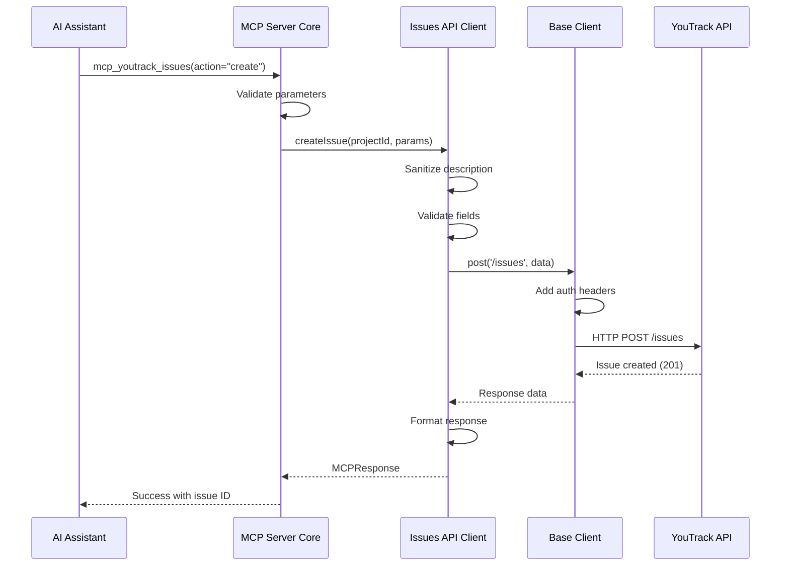
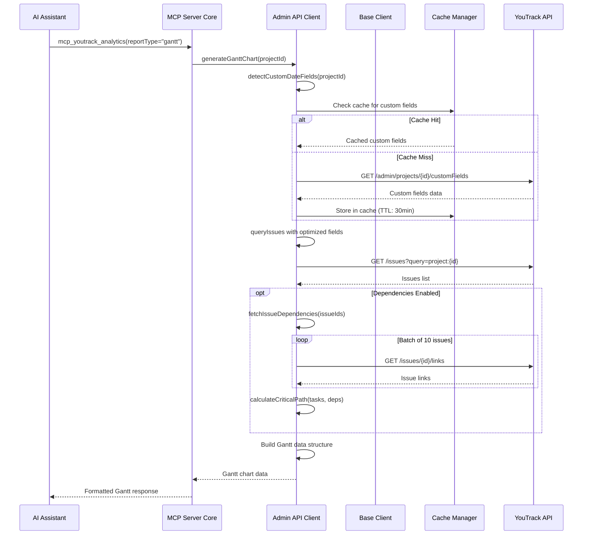

# YouTrack MCP Server Architecture

## Overview

The YouTrack MCP Server is built with a layered architecture that separates concerns and promotes maintainability, testability, and extensibility.

## System Architecture

```
┌─────────────────────────────────────────────────────┐
│              MCP Client (Claude, etc.)              │
└─────────────────┬───────────────────────────────────┘
                  │ MCP Protocol (stdio/HTTP)
┌─────────────────▼───────────────────────────────────┐
│                  MCP Server Core                     │
│  ┌────────────────────────────────────────────────┐ │
│  │          Tool Handlers (server-core.ts)        │ │
│  └────────────────────┬───────────────────────────┘ │
└───────────────────────┼─────────────────────────────┘
                        │
        ┌───────────────┼───────────────┐
        │               │               │
┌───────▼──────┐ ┌─────▼──────┐ ┌─────▼──────┐
│ Issues API   │ │Projects API│ │ Admin API  │
└───────┬──────┘ └─────┬──────┘ └─────┬──────┘
        │              │              │
┌───────▼──────┐ ┌─────▼──────┐ ┌─────▼──────┐
│ Agile API    │ │WorkItems   │ │Knowledge   │
└───────┬──────┘ └─────┬──────┘ └─────┬──────┘
        │              │              │
        └──────────────┼──────────────┘
                       │
        ┌──────────────▼──────────────┐
        │      Base API Client        │
        │   - HTTP client (axios)     │
        │   - Error handling          │
        │   - Response formatting     │
        │   - Cache management        │
        └──────────────┬──────────────┘
                       │
        ┌──────────────▼──────────────┐
        │     YouTrack REST API       │
        │   (v2025.2, OpenAPI 3.0.1)  │
        └─────────────────────────────┘
```

## Layer Responsibilities

### 1. MCP Server Core (`src/server-core.ts`)

**Purpose**: MCP protocol handler and tool orchestration

**Responsibilities:**
- Tool registration and discovery
- Request routing to appropriate API clients
- Parameter validation
- Response formatting for MCP protocol
- Error handling and user-friendly messages
- Tool metadata management

**Key Components:**
```typescript
class YouTrackMCPServer {
  async handleToolCall(tool: string, params: any): Promise<MCPResponse>
  private handleIssues(params: IssueToolParams): Promise<MCPResponse>
  private handleProjects(params: ProjectToolParams): Promise<MCPResponse>
  private handleAnalytics(params: AnalyticsToolParams): Promise<MCPResponse>
  // ... other tool handlers
}
```

### 2. API Client Layer (`src/api/domains/`)

**Purpose**: Domain-specific API interactions

**Structure:**
```
src/api/domains/
├── issues-api.ts         # Issue CRUD, comments, links
├── projects-api.ts       # Project management
├── admin-api.ts          # Admin operations, analytics
├── agile-boards-api.ts   # Boards and sprints
├── workitems-api.ts      # Time tracking
└── knowledge-base-api.ts # Articles and documentation
```

**Responsibilities:**
- Implement domain-specific business logic
- Construct API requests with proper parameters
- Handle domain-specific validation
- Transform responses into user-friendly formats
- Implement retry logic for transient failures

**Example: Issues API Client**
```typescript
export class IssuesAPIClient extends BaseAPIClient {
  async createIssue(projectId: string, params: IssueCreateParams): Promise<MCPResponse>
  async updateIssue(issueId: string, updates: IssueUpdateParams): Promise<MCPResponse>
  async queryIssues(params: IssueQueryParams): Promise<MCPResponse>
  async moveIssueToProject(issueId: string, targetProject: string): Promise<MCPResponse>
  // ... 20+ methods
}
```

### 3. Base API Client (`src/api/base/`)

**Purpose**: Common HTTP operations and utilities

**Components:**

#### `base-client.ts`
Core HTTP client with:
- Axios instance management
- Request/response interceptors
- Authentication header injection
- Timeout configuration
- Connection pooling

```typescript
export abstract class BaseAPIClient {
  protected async get<T>(endpoint: string, params?: any): Promise<T>
  protected async post<T>(endpoint: string, data?: any): Promise<T>
  protected async put<T>(endpoint: string, data?: any): Promise<T>
  protected async delete<T>(endpoint: string): Promise<T>
}
```

#### `cache-manager.ts`
Response caching with:
- TTL-based expiration
- Pattern-based invalidation
- Memory-efficient storage
- Cache hit/miss tracking

```typescript
export class CacheManager {
  async get<T>(key: string, fetcher: () => Promise<T>, ttl: number): Promise<T>
  invalidate(pattern: string): void
  cleanup(): void
  getStats(): CacheStats
}
```

#### `error-handler.ts`
Centralized error handling:
- HTTP error normalization
- User-friendly error messages
- Error logging
- Retry logic

```typescript
export class ErrorHandler {
  static handleAPIError(error: AxiosError): MCPError
  static shouldRetry(error: AxiosError): boolean
  static getRetryDelay(attempt: number): number
}
```

#### `response-formatter.ts`
Consistent response format:
- Success/error wrappers
- Data transformation
- Metadata enrichment
- Type safety

```typescript
export class ResponseFormatter {
  static formatSuccess<T>(data: T, message?: string): MCPResponse
  static formatError(message: string, context?: any): MCPResponse
  static formatCreated<T>(data: T, type: string, message?: string): MCPResponse
}
```

### 4. Authentication Layer (`src/auth/`)

**Purpose**: Authentication and token management

**Components:**

#### `authentication-manager.ts`
- Token validation
- Token refresh
- Session management
- Permission checking

#### `oauth2-manager.ts`
- OAuth2 flow handling
- Browser-based authentication
- Token exchange
- Refresh token management

### 5. Notification Layer (`src/notifications/`)

**Purpose**: Real-time notifications

**Components:**

#### `notification-manager.ts`
- WebSocket connection management
- Event subscription
- Notification filtering
- Callback dispatch

### 6. Utilities (`src/utils/`)

**Purpose**: Shared utilities

**Components:**

#### `text-sanitizer.ts`
- Markdown unescaping
- Line ending normalization
- Whitespace trimming
- HTML entity handling

#### `validation.ts`
- Input validation
- Schema checking
- Type guards
- Custom validators

## Data Flow

### Creating an Issue



### Generating Gantt Chart



## Design Patterns

### 1. Repository Pattern

Each API client acts as a repository for its domain:

```typescript
// Bad: Direct API calls in server core
const response = await axios.get('/issues/DEMO-123');

// Good: Repository pattern
const issue = await issuesAPI.getIssue('DEMO-123');
```

### 2. Strategy Pattern

Different strategies for different operations:

```typescript
interface AnalyticsStrategy {
  generate(params: any): Promise<MCPResponse>;
}

class GanttChartStrategy implements AnalyticsStrategy {
  async generate(params: GanttParams): Promise<MCPResponse> {
    // Gantt-specific logic
  }
}

class TimeTrackingStrategy implements AnalyticsStrategy {
  async generate(params: TimeParams): Promise<MCPResponse> {
    // Time tracking logic
  }
}
```

### 3. Template Method Pattern

Base client provides template, subclasses implement specifics:

```typescript
abstract class BaseAPIClient {
  // Template method
  protected async execute<T>(operation: () => Promise<T>): Promise<T> {
    try {
      return await this.withCache(() => this.withRetry(operation));
    } catch (error) {
      return this.handleError(error);
    }
  }
  
  // Hook methods (can be overridden)
  protected getCacheTTL(): number { return 300; }
  protected getRetryCount(): number { return 3; }
}
```

### 4. Factory Pattern

Response formatting factory:

```typescript
class ResponseFactory {
  static create(type: 'success' | 'error' | 'created', data: any): MCPResponse {
    switch (type) {
      case 'success': return ResponseFormatter.formatSuccess(data);
      case 'error': return ResponseFormatter.formatError(data);
      case 'created': return ResponseFormatter.formatCreated(data);
    }
  }
}
```

### 5. Singleton Pattern

Cache manager and configuration:

```typescript
class CacheManager {
  private static instance: CacheManager;
  
  static getInstance(): CacheManager {
    if (!this.instance) {
      this.instance = new CacheManager();
    }
    return this.instance;
  }
}
```

## Performance Optimizations

### 1. Caching Strategy

```typescript
const cacheTTL = {
  projects: 3600,      // 1 hour (rarely change)
  customFields: 1800,  // 30 minutes
  users: 600,          // 10 minutes
  issues: 60,          // 1 minute
  realtime: 0          // No cache
};
```

### 2. Request Batching

```typescript
// Fetch dependencies in batches of 10
for (let i = 0; i < issueIds.length; i += 10) {
  const batch = issueIds.slice(i, i + 10);
  await Promise.all(batch.map(id => fetchDependencies(id)));
}
```

### 3. Field Selection

```typescript
// Don't fetch all fields
const fields = 'id,summary,created,resolved';  // Only what we need

// Bad: Over-fetching
await client.issues.getIssue('DEMO-123');  // Returns 50+ fields

// Good: Selective fetching
await client.issues.getIssue('DEMO-123', 'id,summary,state');  // Only 3 fields
```

### 4. Connection Pooling

```typescript
const agent = new https.Agent({
  keepAlive: true,
  maxSockets: 50,
  maxFreeSockets: 10
});
```

### 5. Parallel Execution

```typescript
// Sequential (slow)
const project = await getProject(id);
const fields = await getCustomFields(id);
const team = await getTeam(id);

// Parallel (fast)
const [project, fields, team] = await Promise.all([
  getProject(id),
  getCustomFields(id),
  getTeam(id)
]);
```

## Error Handling

### Error Hierarchy

```
Error
├── MCPError (Base MCP error)
│   ├── AuthenticationError (401, 403)
│   ├── NotFoundError (404)
│   ├── ValidationError (400)
│   ├── RateLimitError (429)
│   ├── ServerError (5xx)
│   └── NetworkError (ECONNREFUSED, etc.)
```

### Error Handling Flow

```typescript
try {
  const result = await apiCall();
  return ResponseFormatter.formatSuccess(result);
} catch (error) {
  if (error instanceof AuthenticationError) {
    return ResponseFormatter.formatError('Invalid token. Please check YOUTRACK_TOKEN.');
  } else if (error instanceof RateLimitError) {
    return ResponseFormatter.formatError('Rate limit exceeded. Please wait and retry.');
  } else {
    logger.error('Unexpected error', error);
    return ResponseFormatter.formatError('An unexpected error occurred.');
  }
}
```

## Testing Strategy

### 1. Unit Tests

Test individual methods in isolation:

```typescript
describe('IssuesAPIClient', () => {
  it('should create issue with valid params', async () => {
    const client = new IssuesAPIClient();
    const result = await client.createIssue('DEMO', {
      summary: 'Test Issue'
    });
    expect(result.success).toBe(true);
  });
});
```

### 2. Integration Tests

Test API interactions:

```typescript
describe('Issue Creation Flow', () => {
  it('should create, update, and resolve issue', async () => {
    const issue = await createIssue('DEMO', { summary: 'Test' });
    await updateIssue(issue.id, { priority: 'High' });
    await changeState(issue.id, 'Fixed');
    
    const resolved = await getIssue(issue.id);
    expect(resolved.state).toBe('Fixed');
  });
});
```

### 3. E2E Tests

Test complete workflows:

```typescript
describe('Project Management E2E', () => {
  it('should setup project and create Gantt chart', async () => {
    const project = await createProject('Test');
    await addCustomField(project.id, 'Start Date', 'date');
    await createIssues(project.id, 10);
    
    const gantt = await generateGanttChart(project.id);
    expect(gantt.tasks).toHaveLength(10);
  });
});
```

## Security Considerations

### 1. Token Storage

```typescript
// ✓ Good: Environment variables
const token = process.env.YOUTRACK_TOKEN;

// ✗ Bad: Hardcoded
const token = 'perm:123abc...';
```

### 2. Input Validation

```typescript
// Always validate user input
function validateIssueId(id: string): boolean {
  return /^[A-Z]+-\d+$/.test(id);
}

// Sanitize text input
function sanitizeDescription(text: string): string {
  return text.trim().replace(/[<>]/g, '');
}
```

### 3. Rate Limiting

```typescript
class RateLimiter {
  private requests: number[] = [];
  
  async acquire(): Promise<void> {
    // Implement token bucket or sliding window
  }
}
```

## Extensibility

### Adding a New Tool

1. **Create API client method**:
```typescript
// src/api/domains/issues-api.ts
async getIssueWatchers(issueId: string): Promise<MCPResponse> {
  return this.get(`/issues/${issueId}/watchers`);
}
```

2. **Add tool handler**:
```typescript
// src/server-core.ts
case 'mcp_youtrack_watchers':
  return this.handleWatchers(params);
```

3. **Register tool**:
```typescript
// src/server-core.ts
this.server.tool('mcp_youtrack_watchers', {
  description: 'Manage issue watchers',
  parameters: { /* ... */ }
});
```

### Adding a New API Domain

1. **Create domain client**:
```typescript
// src/api/domains/reports-api.ts
export class ReportsAPIClient extends BaseAPIClient {
  async generateReport(type: string): Promise<MCPResponse> {
    // Implementation
  }
}
```

2. **Register in client**:
```typescript
// src/api/client.ts
export class YouTrackClient {
  public readonly reports: ReportsAPIClient;
  
  constructor(config: Config) {
    this.reports = new ReportsAPIClient(config);
  }
}
```

3. **Add tool handler**:
```typescript
// src/server-core.ts
private async handleReports(params: any): Promise<MCPResponse> {
  return this.client.reports.generateReport(params.type);
}
```

## Deployment

### Production Checklist

- [ ] Set `NODE_ENV=production`
- [ ] Enable caching
- [ ] Configure connection pooling
- [ ] Set appropriate timeouts
- [ ] Enable error logging
- [ ] Monitor performance metrics
- [ ] Set up health checks
- [ ] Configure rate limiting

### Monitoring

```typescript
// Metrics to track
const metrics = {
  requestCount: counter('api.requests'),
  requestDuration: histogram('api.duration'),
  cacheHitRate: gauge('cache.hit_rate'),
  errorRate: counter('api.errors')
};
```

## Future Enhancements

1. **GraphQL Support**: Add GraphQL endpoint for complex queries
2. **WebSocket Support**: Real-time updates via WebSockets
3. **Batch Operations**: Bulk create/update operations
4. **Advanced Caching**: Redis-based distributed caching
5. **Request Queuing**: Job queue for long-running operations
6. **API Versioning**: Support multiple YouTrack API versions

## Resources

- **YouTrack API Docs**: https://www.jetbrains.com/help/youtrack/devportal/resource-api.html
- **MCP Specification**: https://modelcontextprotocol.io/
- **OpenAPI Spec**: `/docs/youtrack-openapi.json`

## Architecture Decisions

### Why Layered Architecture?

1. **Separation of Concerns**: Each layer has clear responsibilities
2. **Testability**: Easy to mock dependencies
3. **Maintainability**: Changes isolated to specific layers
4. **Reusability**: API clients can be used outside MCP context

### Why Multiple API Clients?

1. **Domain Separation**: Issues, projects, agile are separate concerns
2. **Code Organization**: Easier to navigate and maintain
3. **Team Scalability**: Different developers can work on different domains
4. **Testing**: Isolated unit tests per domain

### Why Base Client Pattern?

1. **DRY Principle**: Common HTTP logic in one place
2. **Consistency**: All API calls follow same patterns
3. **Cross-cutting Concerns**: Auth, caching, errors handled centrally
4. **Easy Updates**: Change one place to affect all clients

## Conclusion

The YouTrack MCP Server's architecture prioritizes:
- **Maintainability**: Clear separation of concerns
- **Performance**: Caching, batching, and connection pooling
- **Reliability**: Error handling and retry logic
- **Extensibility**: Easy to add new tools and domains
- **Testability**: Layered design enables comprehensive testing

For questions or contributions, see [CONTRIBUTING.md](../CONTRIBUTING.md).
